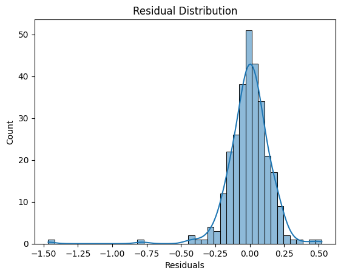

# 🏠 House Price Prediction Using Regression
The first project in my Machine Learning Project Based Learning Plan. This project aims to build a regression model that predicts house prices based on various features such as area, neighborhood, house exterior, and other relevant attributes. The model is trained using Scikit-Learn and evaluated using metrics like RMSE (Root Mean Square Error) and MAE (Mean Absolute Error).

## Dataset:
Source: [Kaggle House Prices - Advanced Regression Techniques Competition](https://www.kaggle.com/c/house-prices-advanced-regression-techniques).

## Technologies Used:
- Python (pandas, numpy, matplotlib, seaborn)
- Scikit-learn (Linear Regression & Lasso)

## Results:
| Metric                     | Score  |
|----------------------------|--------|
| Mean Absolute Error (MAE)  | 0.1054 |
| Mean Squared Error (MSE)   | 0.0263 |
| Root Mean Squared Error (RMSE) | 0.1620 |
| R² Score                  | 0.8266 |

## Future Improvements:
- Try advanced models (XGBoost, LightGBM, Neural Networks)
- Improve feature engineering