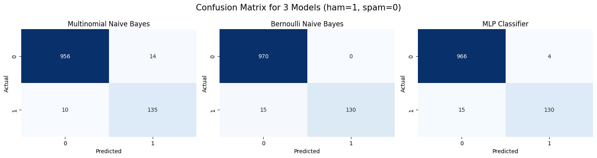
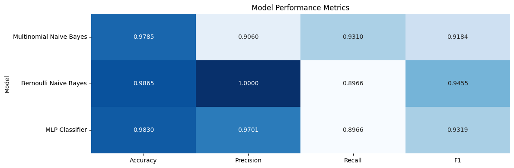

# 🏠 📧 Spam Email Classifier

**Best model for spam detection → Bernoulli Naive Bayes `bernNB`**
- Highest accuracy (98.65%) and perfect precision (100%).
- Lower recall (89.66%) means it might miss some spam.
- Great for precision-focused tasks where false positives are costly.

**Alternative option → Multinomial Naive Bayes `multiNB`**
- Higher recall (93.1%) means it catches more spam than `bernNB`.
- Lower precision (90.6%) means more false positives (some ham emails misclassified as spam).
- Best if missing spam is worse than misclassifying ham.

**`MLP` is not significantly better than `bernNB`.**
- Slightly worse recall than `multiNB` but close to bernNB in performance.
- Not worth the extra computational cost compared to simple Naïve Bayes models.

### Confusion Matrix

### Metric Comparison (Heatmap)
