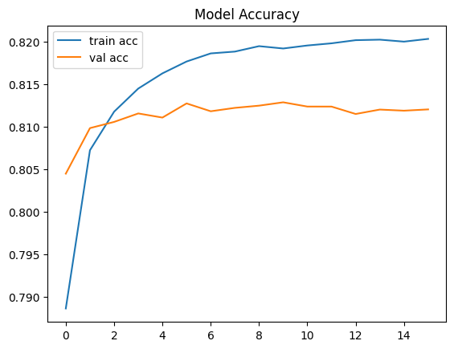
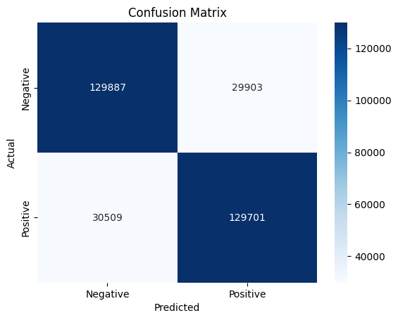

# ✉️ SENTIMENT ANALYSIS ON TWEETS

- **Accuracy:** 0.8112  
- **Macro Avg:** 0.81 (treats all classes equally)  
- **Weighted Avg:** 0.81 (accounts for class imbalance)

#### **Overall Metrics**
- **Precision:** 0.8126 – how many predicted positives are truly positive  
- **Recall:** 0.8096 – how many actual positives were correctly identified  
- **F1-Score:** 0.8111 – harmonic mean of precision and recall

#### **Model Accuracy Plot**

#### **Confusion Matrix**

### ✅ **Summary**
The model performs well with a balanced precision and recall of ~0.81, indicating strong and consistent performance across both classes. The confusion matrix shows a fairly even split in correct predictions for both positive and negative classes, suggesting the model handles class balance effectively.
